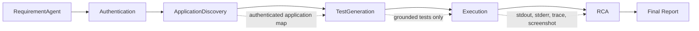

# AI QA Engineer Agent — Evidence-Grounded Autonomous Quality Engineering

An agentic QA platform that converts natural-language requirements into evidence-grounded Playwright tests, executes them in authenticated browser sessions, and performs structured RCA for failures—while refusing to invent unsupported URLs, selectors, or application states.

This is a portfolio project, not a claim that an LLM can replace QA judgment. Its focus is the engineering boundary between probabilistic reasoning and deterministic validation.

## Problem statement

LLMs can draft tests quickly, but plausible-looking selectors, routes, states, and diagnoses are unsafe in an automation pipeline. This project addresses that problem by discovering the authenticated application first, constraining generation to that evidence, rejecting unsupported output in code, and carrying execution artifacts into RCA.

## Architecture



`QAOrchestrator` owns sequencing and persistence. Each specialist owns one decision boundary:

| Component | Responsibility |
|---|---|
| `RequirementAgent` | Convert the user story into structured, independently executable scenarios. |
| `AuthenticationAgent` | Log in with environment-provided credentials and save Playwright `storage_state`. |
| `ApplicationDiscoveryAgent` | Reopen the authenticated session and record observed pages, products, controls, locators, ARIA, and network evidence. |
| `TestGenerationAgent` | Generate a test or explicitly return `cannot_generate`; validate every cited fact and supported literal. |
| `ExecutionAgent` | Run only grounded tests in isolated pytest processes and retain outputs/artifacts. |
| `RCAAgent` | Deterministically classify known failures, then use the model only for evidence-bounded analysis where needed. |
| `QAOrchestrator` | Coordinate stages, continue across individual scenario failures, calculate run metrics, and write the final report. |

See [docs/ARCHITECTURE.md](docs/ARCHITECTURE.md) for the detailed contracts.

## Evidence grounding and safety

Discovery writes an authenticated application map. Generation receives only scenario-relevant parts of that map and must cite exact `path=value` evidence references. A deterministic post-generation check rejects invented URLs, selectors, test IDs, role/name pairs, labels, invalid filenames, missing code, or absent citations. Rejected scenarios are recorded as skipped and never executed.

RCA uses pytest output and available artifacts. Known setup/browser classes are handled without an LLM. Other failures are pre-classified and the model is instructed to preserve that classification, use only supplied evidence, and enumerate missing evidence. This reduces hallucination risk; it does not eliminate it, so RCA remains advisory.

Credentials are read from environment variables, are not included in prompts or reports, and `.env` plus `storage_state` are ignored by Git.

## Setup

Prerequisites: Python 3.10+ and a Chromium-compatible host.

```bash
python -m venv .venv
source .venv/bin/activate
python -m pip install -r requirements.txt
python -m playwright install chromium
```

Create a local `.env` (never commit it):

```dotenv
GEMINI_API_KEY=your_key
QA_BASE_URL=https://www.saucedemo.com
QA_USERNAME=your_username
QA_PASSWORD=your_password
```

The checked-in discovery code is currently tailored to SauceDemo's inventory DOM. On the first run, authentication creates `application_context/storage_state.json`; discovery then creates the authenticated map. A valid existing map may be reused.

## CLI usage

```bash
source .venv/bin/activate
python app.py
```

Enter a requirement when prompted. The CLI prints counts, measured metrics, overall status, and the report location. Complete run data is written beneath `reports/runs/<run-id>/`.

To run the repository tests:

```bash
python -m pytest
```

## Sample user story

> As a shopper, I want to add Sauce Labs Backpack to my cart so that I can purchase it later.

The example set in [`examples/`](examples/) follows this story through analysis, grounding, execution, RCA, and reporting. The RCA example intentionally represents a failed run; it is separate from the passing execution example. Sample metric fields are `null` because examples are not measured runs.

## Sample final report

```json
{
  "requirement": "As a shopper, I want to add Sauce Labs Backpack to my cart so that I can purchase it later.",
  "application_discovery_status": "authenticated_context_valid",
  "overall_status": "PASSED",
  "metrics": {
    "requirement_analysis_latency_seconds": null,
    "generation_latency_seconds": null,
    "execution_duration_seconds": null,
    "rca_latency_seconds": null,
    "grounding_success_rate": null,
    "generated_to_skipped_ratio": null,
    "generated_count": 1,
    "skipped_count": 0,
    "passed_count": 1,
    "failed_count": 0,
    "error_count": 0
  }
}
```

Real reports contain actual run timestamps, measured durations, full structured results, and calculated rates. `generated_to_skipped_ratio` is `null` when there are no skipped scenarios; rates are `null` when there is no denominator.

## Metrics

Metrics are computed per workflow run, never hard-coded:

- requirement analysis, generation, and RCA wall-clock latency;
- summed test execution duration reported by the execution agent;
- grounding success rate: generated / (generated + skipped);
- generated-to-skipped ratio, with a null value for a zero skipped denominator;
- generated, skipped, passed, failed, and infrastructure/error counts.

No benchmark, accuracy, coverage, or productivity claims are made.

## Limitations

- Application discovery is SauceDemo-specific rather than a general crawler.
- Requirement analysis and most RCA require Gemini and can vary between calls.
- Grounding validates known literal patterns; it is not a complete Python semantic verifier.
- Browser evidence is best-effort. A browser crash can prevent screenshots or traces.
- Stored sessions expire and must be regenerated.
- Generated authenticated tests restore the validated `application_context/storage_state.json` session through the shared `page` fixture.
- RCA suggests a probable cause; a human should confirm it before acting.

## Roadmap

- Make discovery adapters pluggable for applications beyond SauceDemo.
- Add explicit support for unauthenticated scenarios alongside the authenticated execution fixture.
- Expand deterministic grounding with AST-based locator and assertion validation.
- Add schema versioning and machine-readable metric definitions.
- Add redaction checks and configurable artifact retention.
- Add CI once tests can run without external credentials or live-browser assumptions.

## Repository status

Badges are intentionally omitted: the repository currently has no checked-in CI workflow, coverage publication, package release, or license metadata to back them.
