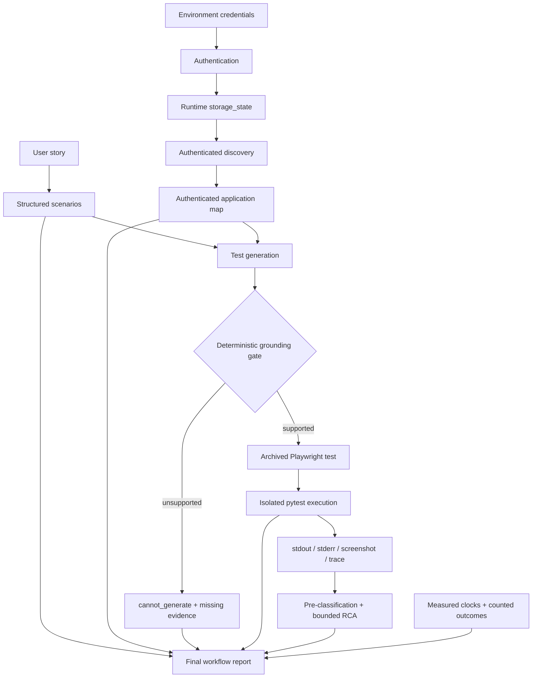

# Architecture

## Why separate agents

The workflow separates interpretation, observation, generation, execution, and diagnosis because each has a different trust boundary. Requirement analysis may reason about intent; discovery may report only browser observations; generation may use only discovered facts; execution runs accepted code; RCA may explain only retained evidence. This makes failures attributable and lets deterministic gates sit between model calls and side effects.

`QAOrchestrator` coordinates these boundaries but does not reproduce agent logic. A failure in one scenario is recorded without preventing independent scenarios from being attempted. Authentication or discovery failure blocks generation because no trustworthy UI basis exists.

## Grounding contract

The contract between discovery and generation is the authenticated application map:

1. Authentication creates Playwright `storage_state` from credentials held only in environment variables.
2. Discovery starts a new browser context with that state and verifies the authenticated inventory page.
3. Discovery records observed URLs, product data, locator candidates, controls, ARIA snapshot, and network resource evidence.
4. Generation reduces the map to scenario-relevant evidence and builds an exact `path=value` catalog.
5. The generated response must cite catalog entries in `evidence_used`.
6. Deterministic validation rejects unsupported URLs, selectors, test IDs, role/name pairs, labels, unsafe filenames, incomplete output, or unknown evidence references.
7. Only a result with `status="generated"` and `grounded=true` can be saved and executed. Otherwise, `cannot_generate` plus `missing_evidence` is the expected safe result.

Grounded means “supported by this captured map and these implemented checks,” not “functionally correct under every possible application state.”

## Deterministic and LLM decisions

| Decision | Owner | Type |
|---|---|---|
| Derive scenarios from prose | RequirementAgent / Gemini | LLM, schema constrained |
| Authenticate and verify route | Authentication + Discovery | Deterministic browser operations |
| Observe application facts | Discovery | Deterministic extraction |
| Select and draft a test | TestGenerationAgent / Gemini | LLM, schema and evidence constrained |
| Accept URLs/selectors/citations/filename | TestGenerationAgent | Deterministic validation |
| Permit execution | ExecutionAgent | Deterministic grounded-status gate |
| Run and map pytest exit state | ExecutionAgent | Deterministic |
| Pre-classify failure signatures | RCAAgent | Deterministic ordered rules |
| Explain non-setup failure evidence | RCAAgent / Gemini | LLM, evidence constrained |
| Calculate counts, rates, durations, overall status | QAOrchestrator | Deterministic |

## Failure classification

RCA checks ordered signatures for browser launch, authentication, locator, assertion, timeout, network, application, test-code, and infrastructure failures; unmatched failures are `unknown`. Pytest assertion failures are kept distinct from setup/fixture errors. Browser or infrastructure failures known to occur before page creation use a deterministic RCA so the system cannot claim it inspected a page that never existed.

For remaining failures, the pre-classification is passed to Gemini and forcibly restored on the returned model. Missing screenshots, traces, console errors, page errors, application maps, or grounding references are recorded explicitly.

## `storage_state`

`application_context/storage_state.json` is a Playwright session snapshot, potentially containing sensitive cookies or tokens. It is runtime-only and ignored by Git. Discovery supplies it directly to `browser.new_context(storage_state=...)`; it does not call the unauthenticated discovery path. The session is verified by the resulting URL and inventory element before evidence is accepted.

The current execution fixture creates a fresh context without `storage_state`. This is sufficient for the checked-in public navigation example but is a documented limitation for generated tests that need an authenticated execution context.

## Evidence flow

Each run is stored under `reports/runs/<run-id>/`, including requirement analysis, archived generated source, per-test execution evidence, RCA where applicable, `workflow_result.json`, and `final_report.json`. Runtime report directories are ignored by Git to avoid publishing transient or sensitive evidence.
