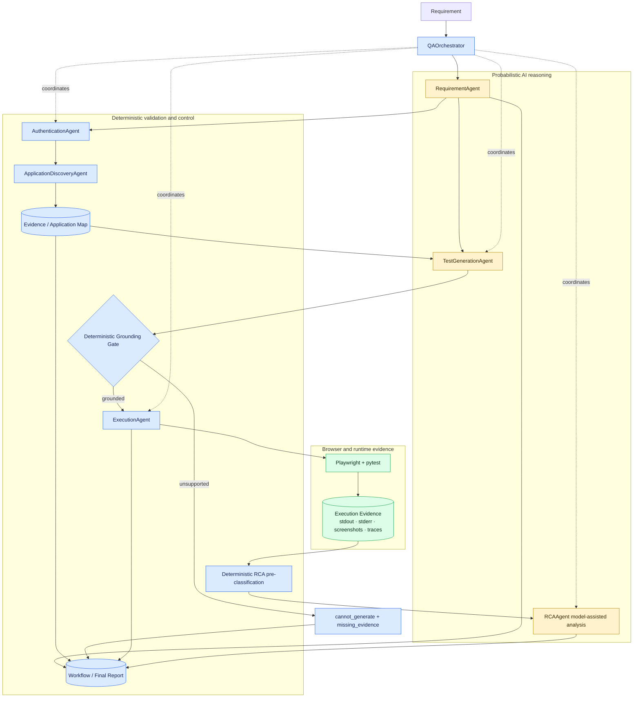

# Architecture

## System view

The platform separates interpretation, observation, generation, validation, execution, and diagnosis because each has a different trust boundary. `QAOrchestrator` coordinates these stages and persists results without duplicating specialist logic.

The top-to-bottom evidence path matches the implementation: requirement analysis, authentication, authenticated discovery, application-map grounding, generation, deterministic acceptance, subprocess execution through pytest/Playwright, retained execution evidence, and RCA.

## Component boundaries

| Component | Responsibility | Decision type |
|---|---|---|
| `RequirementAgent` | Derive structured scenarios from requirement prose. | Model reasoning with a Pydantic/JSON schema |
| `AuthenticationAgent` | Authenticate using environment credentials and save browser state. | Deterministic browser operations |
| `ApplicationDiscoveryAgent` | Verify the authenticated page and observe application/stateful-flow facts. | Deterministic browser extraction |
| `TestGenerationAgent` | Select relevant evidence and draft a test or decline generation. | Model reasoning with schema and evidence constraints |
| Grounding gate in `TestGenerationAgent` | Validate URLs, locator literals, citations, result completeness, and filenames. | Deterministic validation |
| `ExecutionAgent` | Require `generated` plus `grounded=true`, run isolated pytest, and map exit state. | Deterministic control/runtime execution |
| `RCAAgent` | Apply ordered failure signatures, then optionally explain supplied evidence. | Deterministic classification plus bounded model reasoning |
| `QAOrchestrator` | Sequence stages, retain independent failures, compute metrics, and persist reports. | Deterministic coordination |

## Grounding contract

1. Authentication creates Playwright `storage_state` from credentials held in environment variables.
2. Discovery starts a new browser context with that state and verifies the authenticated inventory page.
3. Discovery records observed URLs, product data, locator candidates, controls, ARIA data, network resource evidence, and implemented stateful cart flows.
4. Generation reduces the map to scenario-relevant evidence and builds an exact `path=value` catalog.
5. Generated output must cite catalog entries in `evidence_used`.
6. Deterministic validation rejects unsupported URLs, selectors, test IDs, role/name pairs, labels, unsafe filenames, incomplete output, or unknown references.
7. Only `status="generated"` with `grounded=true` can be saved and executed. Otherwise, `cannot_generate` plus `missing_evidence` is the safe result.

Grounded means supported by the captured evidence and the implemented literal validators. It is not a guarantee of correctness across all states, and the current checks are not full Python semantic or data-flow analysis.

## Failure and evidence flow

Each accepted generated test runs in its own pytest subprocess. The execution agent records exit status, duration, stdout, stderr, failed test names, and any discovered screenshot, trace, or browser-error artifacts.

RCA checks ordered signatures for browser launch, authentication, locator, assertion, timeout, network, application, test-code, and infrastructure failures; unmatched failures remain `unknown`. Known browser/setup failures use deterministic RCA so the system cannot claim it inspected page evidence that did not exist. For other failures, the deterministic pre-classification is passed into model analysis and restored on the returned result.

An individual scenario failure does not prevent other independently generated scenarios from being attempted. Authentication or discovery failure blocks generation because no trustworthy UI evidence exists.

## Runtime state and persistence

`application_context/storage_state.json` can contain cookies or tokens. It is runtime-only, ignored by Git and Docker, and supplied to authenticated discovery and the generated-test fixture. Stored sessions expire and must then be regenerated.

Each workflow run is stored under `reports/runs/<run-id>/`, including requirement analysis, archived generated source, per-test execution evidence, RCA where applicable, `workflow_result.json`, and `final_report.json`. Runtime report directories are ignored because they may contain transient or sensitive browser evidence.

## Current scope

Application discovery is currently SauceDemo-specific. The project has no implemented API-testing agent, test-data agent, multi-provider abstraction, LLM evaluation framework, or quality dashboard. Those ideas are explicitly listed as planned work in the [roadmap](roadmap.md).
